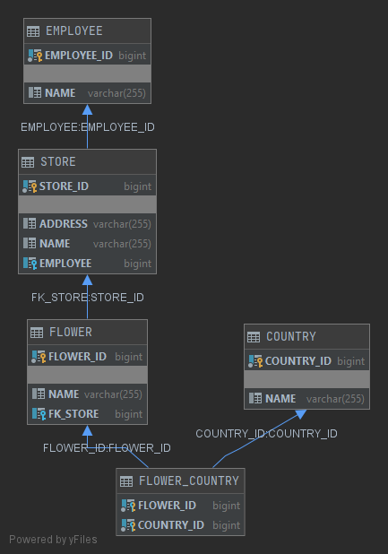

# Flower Shop

The project has 4 entities:
1. Employee
2. Shop
3. Flower
4. Country

* Employee and Shop have association OneToOne, Shop can exist without Employee, but Employee without Shop should be removed automatically.
* Country and Flower have association ManyToMany, Country can exist without Flower, Flower without Country - not
* Shop and Flower have association OneToMany, one Shop for Many Flower objects. Flower without Shop cannot exist, Shop without Flower - can.

---

#CHANGES: #
1. Created 4 tests: 1 for JPA, 1 for controllers, 1 for services and 1 for ML part
2. Changed repository part to JpaRepository
3. Changed some services for normal testing
4. after #3 changed some controllers
